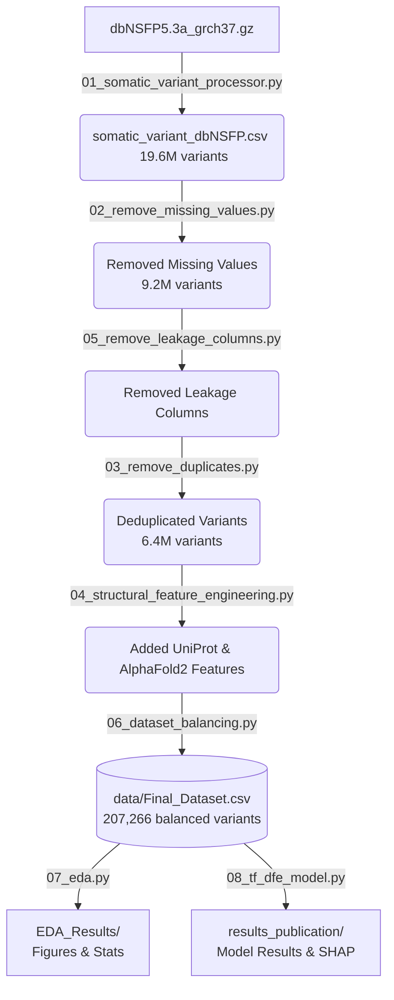

# TF-DFE: Topology-Guided Multi-View Ensemble Learning for Evidence-Aware Somatic Variant Pathogenicity Classification in Cancer Genomics

[](https://www.python.org/downloads/)
[](LICENSE)
[]()

> **Paper:** Topology-Guided Multi-View Ensemble Learning for Evidence-Aware Somatic Variant Pathogenicity Classification in Cancer Genomics  
> **Status:** Under Review at BMC Bioinformatics
> 

## 📌 Overview

**TF-DFE** (Topo-Fractal Dynamic Fuzzy Ensemble) is a highly scalable, evidence-aware machine learning framework designed to classify somatic single nucleotide variants (SNVs) as either pathogenic drivers or benign passengers. To address the complexities of cancer genomics, this framework integrates three distinct feature views:

*   🧬 **Biological Predictors:** Standard functional scores (REVEL, CADD, SIFT, PolyPhen2), evolutionary conservation measures (GERP++, phyloP), and 3D structural/UniProt annotations.
*   🌀 **Fractal Sequence Features:** DNA sequence composition captured via Frequency Chaos Game Representation (FCGR) at $k=3$ and $k=4$ (320 dimensions).
*   🕸️ **Topological Features:** Complex spatial relationships extracted using persistent homology via `giotto-tda` (6 dimensions).
*   🤖 **Dynamic Ensemble Selection:** An enhanced KNORA-Eliminate strategy that adaptively selects the most competent base models for each specific variant.

**Performance Highlights:**  
`MCC: 0.8702` | `AUROC: 0.9666` | `AUPRC: 0.9768` | `Accuracy: 93.48%`


## 🗂️ Repository Structure

```text
TF-DFE/
├── README.md
├── requirements.txt
├── scripts/
│   ├── 01_somatic_variant_processor.py      # dbNSFP parsing, CIViC/COSMIC rescue, labeling
│   ├── 02_remove_missing_values.py          # Selective missing value removal
│   ├── 03_remove_duplicates.py              # Deduplication on chr/pos/ref/alt
│   ├── 04_structural_feature_engineering.py # UniProt + AlphaFold2 + SASA features
│   ├── 05_remove_leakage_columns.py         # Data leakage prevention
│   ├── 06_dataset_balancing.py              # Downsampling to 207,266 balanced variants
│   ├── 07_eda.py                            # Exploratory data analysis (EDA) & visualizations
│   └── 08_tf_dfe_model.py                   # Main TF-DFE model training, evaluation & SHAP analysis
└── data/
    └── Final_Dataset.csv                    # Balanced dataset (207,266 variants, 24 features)
```

## ⚙️ Data Processing Pipeline

To reproduce the study from scratch, execute the scripts sequentially. Each script generates a CSV file that serves as the input for the subsequent step.



*(Note: Scripts `03` and `05` can be executed as per the pipeline flow above).*


## 💾 External Data Requirements

Before running the pipeline, ensure the following large/licensed datasets are downloaded and placed in the working directory (or update the file paths inside the respective scripts).

| File Name | Source | Used In |
| --- | --- | --- |
| `dbNSFP5.3a_grch37.gz` | [dbNSFP Portal](https://dbnsfp.org) | Script 01 |
| `01-Jan-2026-VariantSummaries.tsv` | [CIViC Releases](https://civicdb.org/releases) | Script 01 |
| `Cosmic_CancerGeneCensus_v102_GRCh37.tsv` | [COSMIC](https://cancer.sanger.ac.uk/cosmic) | Script 01 |
| `cmc_export.tsv` | [COSMIC Mutant Census](https://cancer.sanger.ac.uk/cosmic) | Script 01 |
| `oncokb_biomarker_drug_associations.tsv` | [OncoKB](https://www.oncokb.org) | Script 01 |
| `uniprot_sprot_human.dat` | [UniProt Downloads](https://www.uniprot.org/downloads) | Script 04 |
| AlphaFold2 PDB files (`AF-*-model_v*.pdb`) | [AlphaFold DB](https://alphafold.ebi.ac.uk/download) | Script 04 |


## 🚀 Installation & Quick Start

**1. Clone the repository and install dependencies:**

```bash
git clone [https://github.com/asifahamed11/TF-DFE.git](https://github.com/asifahamed11/TF-DFE.git)
cd TF-DFE
pip install -r requirements.txt

```

*(Requires Python 3.8 or higher)*

**2. Skip to Model Training:**
If you wish to bypass the data curation steps and directly evaluate the model using our pre-processed dataset:

```bash
# Ensure DATA_PATH in script 08 points to data/Final_Dataset.csv
python scripts/08_tf_dfe_model.py

```

All outputs, including performance metrics and figures, will be generated in the `results_publication/` directory.


## 📊 Dataset Features

The final balanced dataset (`data/Final_Dataset.csv`) contains **207,266 somatic SNVs** (103,633 pathogenic and 103,633 benign).

| Feature Category | Included Features | Dimensions |
| --- | --- | --- |
| **Genomic Coordinates** | `chr`, `pos`, `ref`, `alt` | 4 |
| **Pathogenicity Scores** | `REVEL`, `CADD`, `SIFT`, `PolyPhen2`, `GERP++`, `phyloP` | 6 |
| **Cancer Annotations** | `IS_CANCER_GENE`, `IS_TIER1`, `IS_ONCOGENE`, `IS_TSG` | 4 |
| **Structural (3D)** | `SASA`, `RELATIVE_SASA`, `PLDDT_SCORE` | 3 |
| **Functional Sites** | `IS_IN_DOMAIN`, `IS_ACTIVE_SITE`, `IS_BINDING_SITE`, `IS_TRANSMEMBRANE`, `DISTANCE_TO_ACTIVE_SITE` | 5 |
| **Target Label** | `LABEL_PATHOGENIC` (0 = Benign, 1 = Pathogenic) | 1 |

*(Note: The 320-dim FCGR and 6-dim TDA features are computed dynamically during model execution inside `08_tf_dfe_model.py`).*


## 📈 Reproducing Figures

All manuscript figures are fully reproducible:

* **Model Evaluation & SHAP:** Run `08_tf_dfe_model.py`. Outputs are saved in `results_publication/` (both `.png` and `.tiff` formats).
* **Exploratory Data Analysis (EDA):** Run `07_eda.py` to generate the exploratory figures (e.g., class distributions, mutation spectrums) saved in `EDA_Results/`.

## 📖 Citation

This repository contains the code and dataset for our manuscript currently under peer review. Full citation details will be updated upon publication.

```bibtex
@unpublished{tfdfe2026,
  title={Topology-Guided Multi-View Ensemble Learning for Evidence-Aware Somatic Variant Pathogenicity Classification in Cancer Genomics},
  author={Anonymous Authors},
  note={Under Review at BMC Bioinformatics},
  year={2026}
}

```

## 📜 License

This project is licensed under the MIT License. See the [LICENSE](https://www.google.com/search?q=LICENSE) file for full details.


## ✉️ Contact

For any questions, discussions, or issues regarding this repository or the dataset during the review process, please open an **Issue** directly in this GitHub repository. Contact details will be updated once the manuscript is published.
