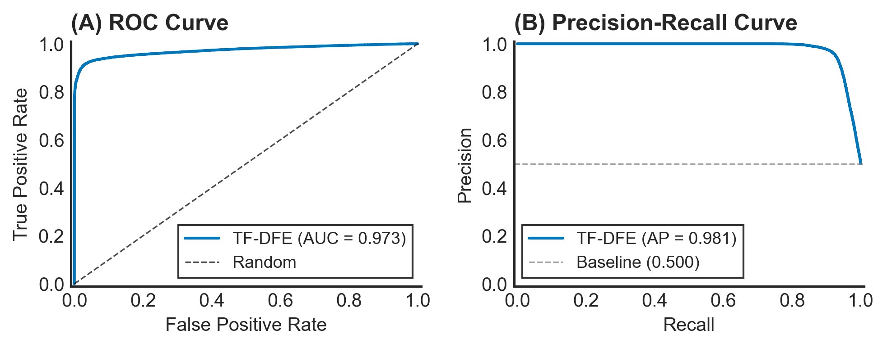
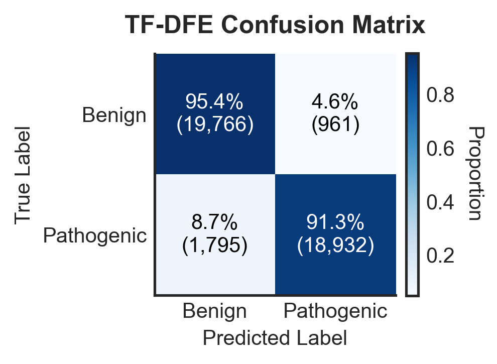
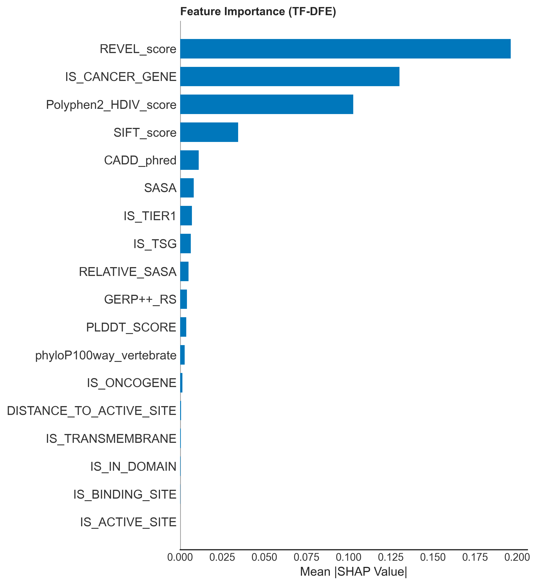

# Pathogenicity Prediction Framework

This repository contains the preprocessing, feature engineering, and modeling scripts for the pathogenicity prediction project.

## Results

MCC: **0.8809** · AUROC: **0.9724** · 207K variants (dbNSFP v5.3a)

|  |  |  |
| :---: | :---: | :---: |
| **ROC & PR Curves** | **Confusion Matrix** | **SHAP Feature Importance** |

## Repository Structure

- `src/` : Contains all Python scripts, numbered in execution order (01 to 10).
- `src/config.py` : Centralized configuration for input and output paths.
- `data/` : Directory intended for raw datasets (e.g., dbNSFP, hg19.fa). Note that datasets are excluded from Git due to their size.
- `outputs/` : Directory for all generated CSVs, models, and figures.

## Pipeline stages

The scripts in `src/` run in order; each reads the previous stage's output and writes to its own `outputs/` subfolder.

| Script                            | Stage                                                                   |
| --------------------------------- | ----------------------------------------------------------------------- |
| `01_dbnsfp_processor.py`          | Parse and filter dbNSFP into the base variant table                     |
| `02_remove_missing_values.py`     | Drop rows with missing values (outside retained columns)                |
| `03_remove_duplicates.py`         | Remove duplicate variants                                               |
| `04_feature_engineering.py`       | Structural / functional feature engineering (AlphaFold, sequence, FCGR) |
| `05_remove_leakage.py`            | Drop label-leaking annotation columns                                   |
| `06_clean_and_finalize.py`        | Final cleaning and column preparation                                   |
| `07_dataset_balancing.py`         | Balance the pathogenic / benign classes                                 |
| `08_tda_fuzzy_ensemble.py`        | TDA + fuzzy KNORA-E ensemble: train and evaluate                        |
| `09_reviewer_experiments.py`      | Supplementary audits, ablations, and diversity analysis                 |
| `10_exploratory_data_analysis.py` | Exploratory figures and summary statistics                              |

## Data Setup

Due to GitHub file size limits, the 76GB of raw data is not tracked in this repository.

1. Download the datasets: **[Google Drive Link](https://drive.google.com/drive/folders/1sWNL6u6Fj5UEpQuplooFZFaDzfc0eUwS?usp=sharing)**
2. Place them in the `data/` folder (see `data/README.md` for the expected layout), **or**
3. Point at an existing local copy without touching any code: `export TFDFE_DATA_DIR=/path/to/your/Datasets` before running the scripts.

## Installing dependencies

`pip install -r requirements.txt`

Note: `biopython`, `giotto-tda`, and `pyfaidx` are core to the method (structural + topological features in scripts 04 and 08), not optional extras — install them even though the code itself guards each import with try/except for graceful fallback.

## Running the Pipeline

Run the scripts in numerical order from the `src/` directory. All outputs are saved automatically into organized subfolders within `outputs/` (created on first run).
